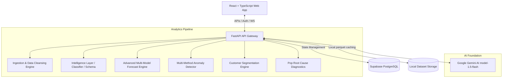
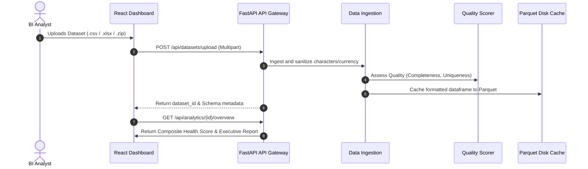
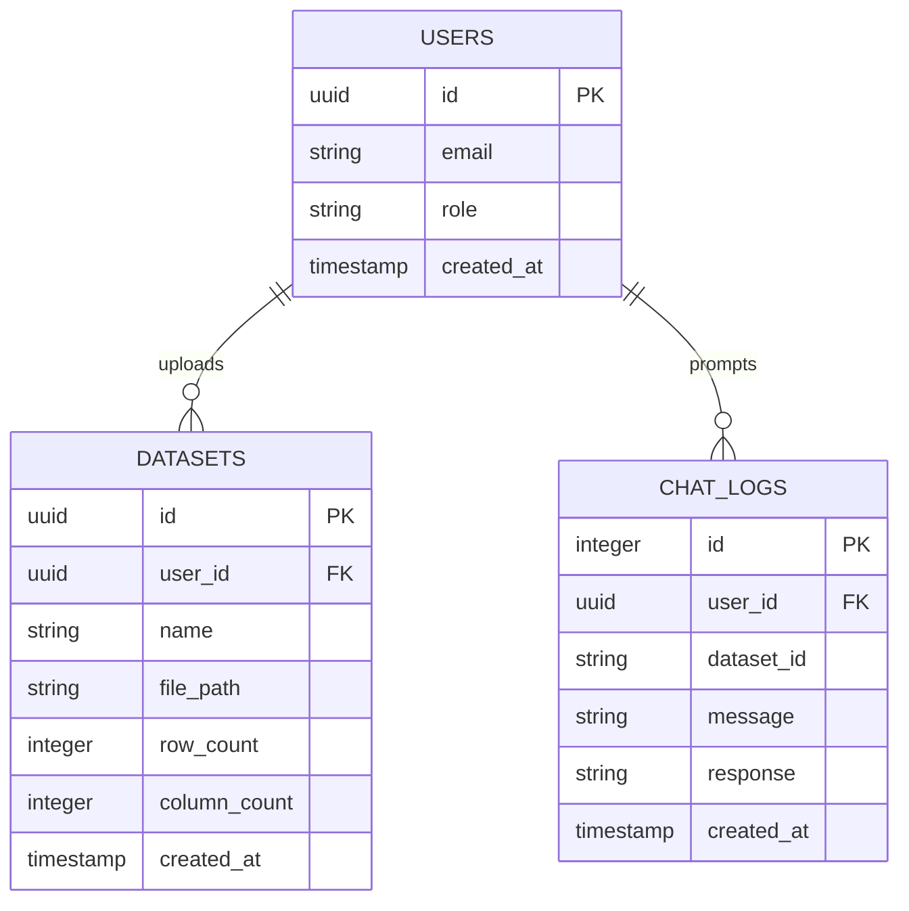
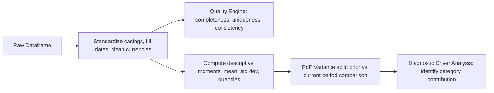

# InsightIQ — Enterprise SaaS Architecture & Diagnostic Methodologies

This document outlines the design architecture, database patterns, data flows, and diagnostic methodologies powering the **InsightIQ** platform.

---

## 1. System Architecture

---

## 2. System and Component Data Flow

---

## 3. Database Schema

The database model is managed via Supabase (PostgreSQL). Below is the active relational mapping:

---

## 4. Analytical Pipeline

---

## 5. Technology Selection & Rationale

| Technology | Role | Selection Rationale |
| :--- | :--- | :--- |
| **FastAPI** | Backend Web Framework | Asynchronous capabilities (lifespan, dependencies), automatic OpenAPI/Swagger generation, and rapid serialization performance. |
| **React + TypeScript** | Frontend UI Framework | Strict type-safety guarantees, component reusability, rich chart rendering via Recharts, and fast virtual DOM repaints. |
| **XGBoost & Scikit-Learn** | Predictive Modeling | XGBoost outperforms classic statistical time-series methods on volatile or complex lag relationships by learning regression trees on lag features. |
| **Pandas** | In-Memory Data Manipulation | Industrial standard for tabular structures, indexing, groupings, and quick vector metrics. |
| **Google Gemini AI** | Cognitive Intelligence Layer | Gemini 1.5 Flash provides exceptional context window limits, structured JSON output formats, and rapid inference latency. |

---

## 6. Diagnostic Methodologies

### A. Explainable Health Score
The health score is structured as a transparent, weighted compound index:
- **Data Quality (35%)**: Gauges column value validations and outliers.
- **Forecast Stability (20%)**: Employs model validation $R^2$ scores to assess metric stability.
- **Anomaly Penalty (20%)**: Standardizes outlier rates; penalizes values deviating past $3\sigma$ thresholds.
- **KPI Performance (15%)**: Assesses trend indicators (upward growth vs decline ratios).
- **Completeness (10%)**: Measures null cell densities.

### B. Auto-Selecting Forecasting Engine
To ensure robust, high-accuracy time-series forecasting, we evaluate three distinct methodologies:
1. **Linear Trend Forecasting**: Captures structural long-term trajectory slopes.
2. **XGBoost Regression**: Captures non-linear autoregressive structures using lags ($t-1$, $t-2$, $t-3$) as features.
3. **Prophet (Optional)**: Automatically adjusts for multi-period seasonal components and growth changes.

**Evaluation Framework**:
We divide history into an **80/20 train/validation split**. Each model is trained on the first 80%, predicts the remaining 20% validation window, and is evaluated using:
- **MAE**: $\frac{1}{n}\sum |y_i - \hat{y}_i|$
- **RMSE**: $\sqrt{\frac{1}{n}\sum (y_i - \hat{y}_i)^2}$
- **MAPE**: $\frac{100\%}{n}\sum |\frac{y_i - \hat{y}_i}{y_i}|$
- **R²**: $1 - \frac{SS_{res}}{SS_{tot}}$

The model returning the lowest Validation MAE is selected, fitted on all data, and projected into the future.
